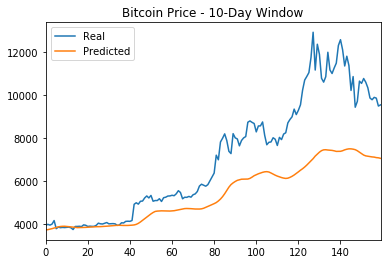
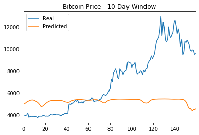
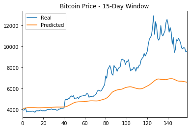
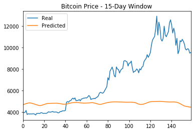
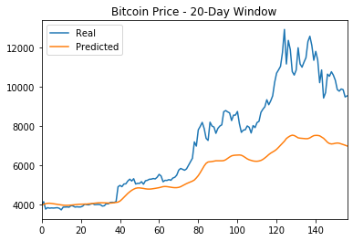
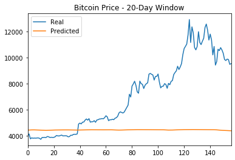

# Deep Learning Bitcoin Price

This project will use the crypto Fear and Greed (FNG) Index to generate a FNG value to compare results with a deep learning model using closing prices. This will determine if the FNG indicator is a better signal than closing data. In the end, both models will attempt to predict closing price.

The first step of the project was to prepare the data, as documented below.

## Preparing the data for training and testing

For the Fear and Greed model, the project used the FNG values to predict the closing price.

For the closing price model, it used previous closing prices to predict the next closing price.

Each model used 70% of the data for training and 30% of the data for testing.

Applied a MinMaxScaler to the X and y values to scale the data for the model.

Finally, reshaped the X_train and X_test values to fit the model's requirement of (samples, time steps, features).

The following step of the project was to build and train the models, as documented below.

## Build and train custom LSTM RNNs

Each of the Jupyter notebooks in the Code directory were created using the same custom LSTM RNN architecture. In one notebook, the project fit the data using the FNG values. In the second notebook, it fit the data using only closing prices. The notebooks' file names indicate which is which.

It also use the same parameters and training steps for each model. This was necessary to compare each model accurately.

Lastly, the final step is to compare each of the findings from each model, as documented below.

## Evaluate the performance of each model

In conclusion, the testing data is used to evaluate each model and compare the performance.

The data was used to answer the following:

>	Which model has a lower loss?

The model that was a lower loss is using the closing prices to predict future closing prices.

>	Which model tracks the actual values better over time?

The model that tracks the actual values better over time is using the closing prices to predict the closing prices.

>	Which window size works best for the model?

The window size that works best is a twenty day window size.

## Graphical comparisons

Each of the following comparison graphs are in the following order: closing price (top) and FNG (bottom).

### 10-Day Window comparisons

### 15-Day Window comparisons

### 20-Day Window comparisons

## Built With

* [Crypto Fear & Greed Index](https://alternative.me/crypto/fear-and-greed-index/) - The Fear & Greed Index for Bitcoin and other large cryptocurrencies.
* [Python](https://www.python.org/) - Programming language.
* [NumPy](https://numpy.org/doc/stable/) - Package for scientific computing with Python.
* [Pandas](https://pandas.pydata.org/) - Data analysis and manipulation tool.
* [hvPlot](https://hvplot.holoviz.org/) - High-level plotting API for the PyData ecosystem.
* [Matplotlib](https://matplotlib.org/contents.html) - Comprehensive library for creating static, animated, and interactive visualizations in Python.
* [TensorFlow](https://www.tensorflow.org/guide) - End-to-end open source platform for machine learning.
* [scikit-learn](https://github.com/scikit-learn/scikit-learn) - Python module for machine learning built on top of SciPy.

## Authors

* **Roberto Cantu**  - [GitHub](https://github.com/RCantu92)